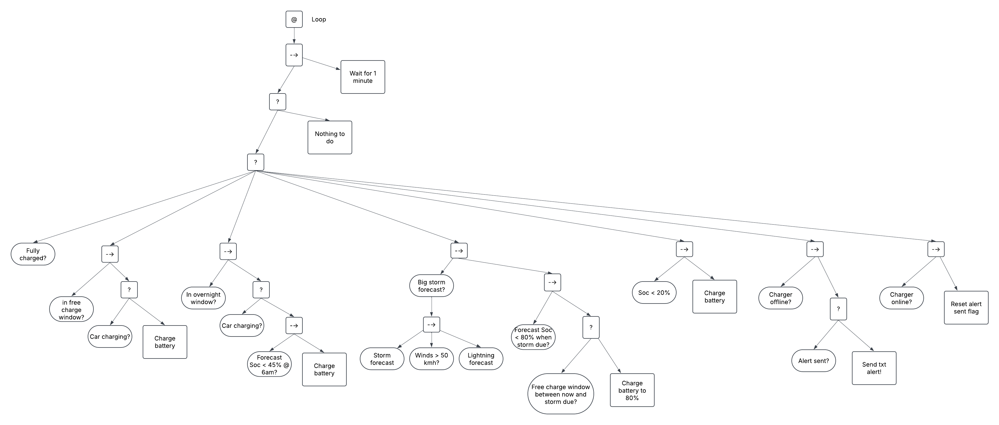

## Behaviour Trees -- Home Battery Controller
A small example program for playing around with behaviour trees that got a bit out of hand.

This is an implementation of behaviour trees for controlling a home battery and EV charger.

The behaviour tree is intended to look something like this:

### Install

`git clone https://github.com/pdmct/behaviour-trees-controller.git`

You will also need to have in your environment the ENV VARS listed in the `config.edn` file.
Use as your own risk ... there are better (more secure) ways to do this.

### ToDo

1. Implement the better ways

2. Implement retrieval fo battery SoC

3. Refactor the behaviour tree and behaviors into a separate file to clean up core.clj

4. Restructure repo to make be a bit more organised

### Generating the Behavior Tree Diagram

To generate the behavior tree diagram, follow these steps:

1. Ensure you have the `rhizome` library installed. You can add it to your `deps.edn` file as a dependency.
2. Run the `-main` function in `src/bt_controller/core.clj` with the `--generate-diagram` flag. This will generate the behavior tree diagram and save it as `resources/behavior_tree.png`.

Uses the `aido` library: https://github.com/mmower/aido/tree/master.

MIT License -- see LICENSE file for details.
